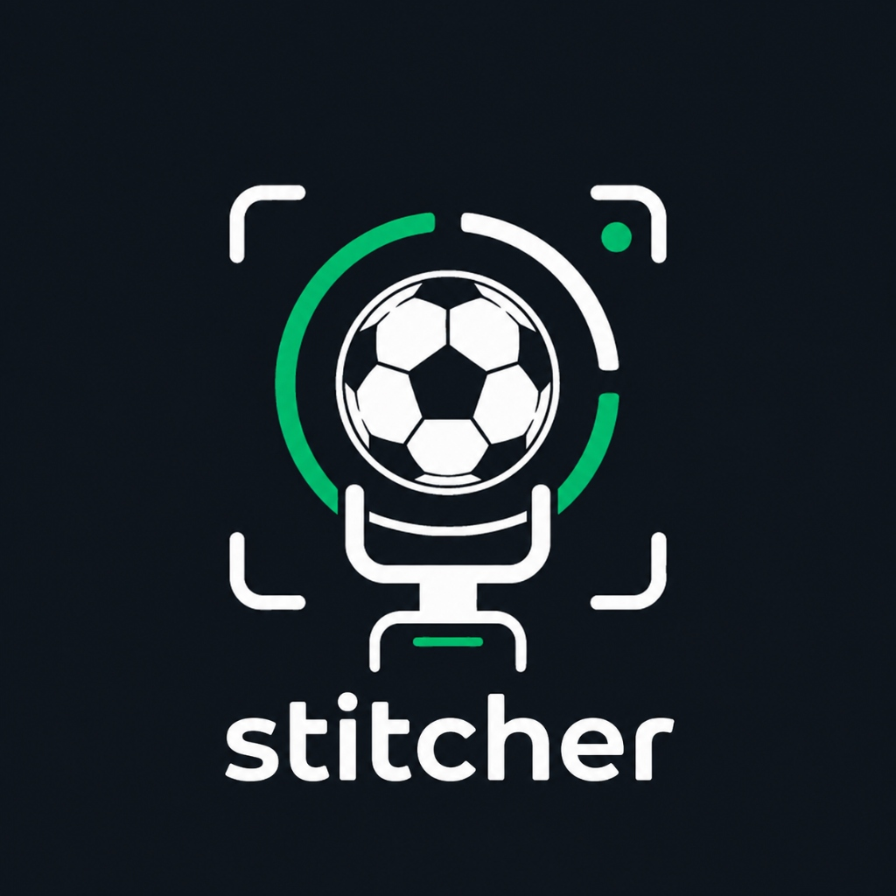
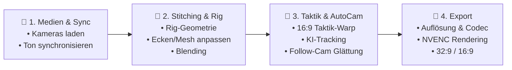

# MatchTrack-Stitcher

<div align="center">



### Professioneller 32:9 Fußball-Panorama Stitcher & KI-gestützte 16:9 Broadcast Follow-Cam

[](https://github.com/soko-grafik/matchtrack-stitcher/releases/tag/v1.5.0)
[](https://www.python.org/)
[](https://pypi.org/project/PySide6/)
[](https://opencv.org/)
[](https://docs.ultralytics.com/)
[](https://developer.nvidia.com/video-encode-decode-gpu-support-matrix)
[-0078D6.svg?logo=windows&logoColor=white)](https://github.com/soko-grafik/matchtrack-stitcher/releases)
[](#lizenz)

[**Download Windows Installer (v1.5.0)**](https://github.com/soko-grafik/matchtrack-stitcher/releases/tag/v1.5.0) • [**Dokumentation**](#-workflow-anleitung) • [**CLI Reference**](#-cli-batch-modus) • [**Release Notes**](#-release-notes--changelog)

</div>

---

## 📖 Inhaltsverzeichnis

- [Über das Projekt](#-über-das-projekt)
- [Hauptfunktionen](#-hauptfunktionen)
- [Systemanforderungen](#-systemanforderungen)
- [Installation & Schnellstart](#-installation--schnellstart)
  - [Option A: Windows Setup Installer (Empfohlen)](#option-a-windows-setup-installer-empfohlen)
  - [Option B: Ausführen aus dem Quellcode](#option-b-ausführen-aus-dem-quellcode)
- [Der 4-Schritte-Workflow](#-der-4-schritte-workflow)
  - [1. Medien & Sync](#1--medien--sync)
  - [2. Stitching & Rig](#2--stitching--rig)
  - [3. Taktik & AutoCam](#3--taktik--autocam)
  - [4. Export](#4--export)
- [CLI-Headless- & Batch-Modus](#-cli-batch-modus)
- [DJI Action 4 Dual-Rig Empfehlungen](#-dji-action-4-dual-rig-empfehlungen)
- [Projektstruktur](#-projektstruktur)
- [Build & Packaging](#-build--packaging)
- [Release Notes / Changelog](#-release-notes--changelog)
- [Lizenz](#-lizenz)

---

## ⚽ Über das Projekt

**MatchTrack-Stitcher** ist eine hochperformante Desktop-Anwendung und Batch-Pipeline zur automatischen und manuellen Zusammenführung (Stitching) von zwei Action-Cam-Videos (z. B. 2× **DJI Osmo Action 4**, GoPro etc.) zu einem ultraweiten **32:9 Panorama-Gesamtbild** eines gesamten Fußballplatzes.

Zusätzlich beinhaltet das System eine **KI-gestützte 16:9 Broadcast Follow-Cam (AutoCam)**: Mittels modernster **YOLO11-Objekterkennung** werden Fußball und Spieler in Echtzeit lokalisiert, über einen **2D-Kalman-Filter mit physikalischer Kinematik** geglättet und über ein vorausschauendes **2-Pass Lookahead-Verfahren** in eine flüssige, fernsehreife Kameraschwenk-Perspektive übertragen – vollautomatisch, ohne Kameramann vor Ort.

---

## ✨ Hauptfunktionen

### 🎥 Nahtloses Dual-Kamera Stitching
- **Mathematisch präzise Projektion:** 3D-Zylinder- und sphärische Projektion mit individueller Ausrichtung beider Kameras (Yaw, Pitch, Roll, Konvergenz, vertikaler Versatz und optisches Zentrum $c_x, c_y$).
- **Objektivprofile & Dewarping:** Vordefinierte Profile für DJI Osmo Action 4 (1080p, 2.7K, 4K Standard/Dewarp, Wide, Ultrawide) sowie Unterstützung für Fisheye-Entzerrung (Kannala-Brandt) und Pinhole-Modelle.
- **Interaktives 4-Punkt-Corner-Mesh:** Direktes Verschieben der Ecken im Viewport per Drag & Drop für perfekte manuelle Feinjustierung.
- **Automatisches Feature-Matching:** Automatisierte Ausrichtung über SIFT/ORB-Merkmalsabgleich im Überlappungsbereich.
- **Multi-Band & Linear Blending:** Seidenweiche Überblendung im Überlappungsbereich ohne sichtbare Nähte oder Geisterbilder.

### ⚡ Akustische Audio-Synchronisation
- **Automatische Kreuzkorrelation (Cross-Correlation):** Gleicht den Audio-Versatz beider Kameras auf die Millisekunde genau ab.
- **Manuelle Offset-Korrektur:** Millisekunden- und Frame-genaue Feinjustierung.
- **Audio-Routing:** Wählbar zwischen linker Audiospur, rechter Audiospur, 50/50 Mixdown oder Stummschaltung (Mute).

### 🤖 KI-Ball- & Spielertracking (YOLO11)
- **Moderne KI-Modelle:** Nahtlos integrierte Modelle (`yolo11m_football_player.pt`, `yolo11n_football_ball.pt`).
- **Physik-gefilterter Ball-Tracker:** 2D-Kalman-Filter mit Modellierung des aerodynamischen Luftwiderstands und Validierung plausibler Ballgeschwindigkeiten (verhindert Sprünge durch Fehlmessungen).
- **Spielerdichte-Gewichtung:** Intelligentes Ausrichten der Kamera am Ballgeschehen unter Berücksichtigung der Spielerballung.

### 🎬 AutoCam / Follow-Cam (16:9 Broadcast)
- **Human-Like Motion Smoothing:** 2-Pass Lookahead-Filterung antizipiert Spielzüge und erzeugt kinoreife Schwenks ohne Ruckeln oder Hektik.
- **Deadband-Zone & Zoom-Stabilität:** Horizontale Schwenks mit einstellbarer Reaktionsschwelle und sanfter Dämpfung.
- **Ball-Fadenkreuz (Reticle):** Zuschaltbare visuelle Markierung zur Analyse und Verfolgung des Spielgeräts.

### 📐 16:9 Tactical Field Warp
- **Spielfeld-Begradigung:** Entzerrt gekrümmte oder trapezförmige Spielfeldkanten über ein 6-Punkt-Polygon (TL, TC, TR, BR, BC, BL).
- **Planare Taktikansicht:** Erzeugt eine gleichmäßige, rechtwinklige 16:9-Taktikperspektive des gesamten Platzes für Trainer und Videoanalysten.

### 🚀 Hardware-beschleunigter Export (NVENC)
- **NVIDIA GPU Beschleunigung:** Superschneller Export via `hevc_nvenc` (H.265) und `h264_nvenc`, sowie CPU-Fallback (`libx264`).
- **Vielseitige Export-Modi:**
  - `32:9` Panorama Master (z. B. 3840×1080, 5760×1620, 7680×2160)
  - `16:9` Broadcast Follow-Cam (Full HD 1080p, 4K)
  - `21:10` Squeezed Panorama (optimiert für Ultrawide-Monitore)
  - `both` Dual-Pass Export (erzeugt 32:9 Master & 16:9 Broadcast in einem optimierten Batch-Durchlauf)
- **Live-Rendering-Metriken:** Fortschrittsanzeige mit verarbeiteten Frames, Render-FPS und genauer Restzeit (ETA).

### 🖥️ Moderne PySide6 Benutzeroberfläche
- **Ergonomisches Dark-Theme:** Professionelle Optik optimiert für lange Analyse-Sessions.
- **Zero-Lag Slider Engine:** Schnelle Voransicht im Draft-Modus mit 45ms Debounce-Rendering für gestochen scharfe High-Res-Aktualisierung.
- **Strukturierter 4-Schritte-Workflow:** Übersichtlich aufgeteilt in Medien & Sync, Stitching & Rig, Taktik & AutoCam sowie Export.
- **Integrierte Log-Konsole:** Echtzeit-Statusmeldungen mit Filterfunktion nach Info, Warnung und Fehler.

---

## 💻 Systemanforderungen

| Komponente | Mindestanforderung | Empfohlen |
| :--- | :--- | :--- |
| **Betriebssystem** | Windows 10 (64-bit) | Windows 11 (64-bit) |
| **Prozessor (CPU)** | Intel Core i5 / AMD Ryzen 5 (4 Kerne) | Intel Core i7 / AMD Ryzen 7 (8+ Kerne) |
| **Grafikkarte (GPU)** | NVIDIA GTX 1060 (4 GB VRAM) | NVIDIA RTX 3060 / 4070 oder besser (CUDA & NVENC) |
| **Arbeitsspeicher (RAM)** | 16 GB | 32 GB DDR4 / DDR5 |
| **Speicherplatz** | 2 GB freier Speicherplatz | Schnelle NVMe SSD für Video-Rendering |
| **Kameras** | 2× Action-Kameras (z. B. DJI Action 4) | Dual-Rig mit ca. 80° Öffnungswinkel |

---

## 📦 Installation & Schnellstart

### Option A: Windows Setup Installer (Empfohlen)

Für Endanwender und Analysten steht ein vorkompilierter Standalone-Installer zur Verfügung, der sämtliche Abhängigkeiten, FFmpeg und KI-Modelle bündelt:

1. Laden Sie die Datei **`MatchTrack-Stitcher-Setup-v1.5.0.exe`** unter [**Releases**](https://github.com/soko-grafik/matchtrack-stitcher/releases/tag/v1.5.0) herunter.
2. Führen Sie die Setup-Datei aus und folgen Sie dem Installationsassistenten.
3. Starten Sie **MatchTrack Stitcher** bequem über das Startmenü oder die Desktop-Verknüpfung.

---

### Option B: Ausführen aus dem Quellcode

Für Entwickler oder zur Anpassung von Modellen und Algorithmen:

#### 1. Repository klonen
```bash
git clone https://github.com/soko-grafik/matchtrack-stitcher.git
cd matchtrack-stitcher
```

#### 2. Virtuelle Python-Umgebung erstellen
```bash
python -m venv .venv
.venv\Scripts\activate
```

#### 3. Abhängigkeiten installieren
```bash
pip install --upgrade pip
pip install -r requirements.txt
pip install ultralytics torch torchvision --index-url https://download.pytorch.org/whl/cu121
```

#### 4. FFmpeg bereitstellen
Stellen Sie sicher, dass sich `ffmpeg.exe` und `ffprobe.exe` entweder im Systempfad (`PATH`) oder im Unterordner `bin/` des Projekts befinden.

#### 5. Anwendung starten
```bash
python main.py
```

---

## 🔄 Der 4-Schritte-Workflow

Die Benutzeroberfläche führt Sie logisch und strukturiert in 4 Schritten vom Rohmaterial zum fertigen Video:



### 1. 📁 Medien & Sync
- **Videoeingänge wählen:** Laden Sie entweder die linken und rechten Kameravideos (Dual-Cam Modus) oder öffnen Sie direkt ein bereits fertiges 32:9 Panoramavideo.
- **Audio-Sync:** Klicken Sie auf **"Automatisch via Audio abgleichen"**, um den Versatz über die Tonspuren beider Kameras zu ermitteln, oder justieren Sie den Versatz manuell in Frames bzw. Millisekunden.
- **Audioquelle:** Legen Sie fest, ob für den finalen Export der Ton von Kamera 1 (Links), Kamera 2 (Rechts) oder ein gemischter Stereomixdown genutzt werden soll.

### 2. 🎯 Stitching & Rig
- **Kameraprofil:** Wählen Sie das passende Profil für Ihre Kamera (z. B. *DJI Action 4 1080p Standard/Dewarp*).
- **Rig-Geometrie:** Justieren Sie Konvergenzwinkel (Yaw), Neigung (Pitch), Drehung (Roll) und FOV mit den Schiebereglern oder dem Reset-Button `↺`.
- **Interaktives Mesh:** Im Viewport können die 4 Eckpunkte beider Kameras direkt mit der Maus verschoben werden.
- **Auto-Kalibrierung:** Nutzen Sie den Button **"Rig automatisch kalibrieren (SIFT)"**, um Rotationswinkel automatisch anhand markanter Punkte im Überlappungsbereich zu berechnen.
- **Naht & Blending:** Passen Sie die Nahtposition und die Überblendungsbreite für einen unsichtbaren Übergang an.

### 3. 📐 Taktik & AutoCam
- **16:9 Taktik-Warp:** Aktivieren Sie den Taktik-Modus und platzieren Sie die 6 Referenzpunkte auf den Schnittpunkten der Spielfeldlinien (4 Platzecken + 2 Mittellinienpunkte), um ein perfekt rechtwinkliges Taktikbild zu erhalten.
- **KI-Tracking:** Aktivieren Sie die Ball- und Spieler-Erkennung. Passen Sie Vertrauensschwellen (Confidence Threshold) und Reaktionsgeschwindigkeiten an.
- **Lookahead Follow-Cam:** Stellen Sie die Dämpfung, die Toleranzzone (Deadband) und den Lookahead-Horizont ein, um butterweiche Kameraschwenks zu erzielen.

### 4. 🚀 Export
- **Export-Modus:**
  - `32:9 Panorama` – Vollständige Breitbildübersicht (z. B. 3840×1080).
  - `16:9 Follow-Cam` – Dynamischer Kameraschnitt auf Spielhöhe (z. B. 1920×1080).
  - `21:10 Squeezed` – Gleichmäßig komprimierte Übersicht für 21:9 Bildschirme.
  - `Beide (32:9 & 16:9)` – Effizientes 2-Stufen-Rendering beider Formate in einem Durchgang.
- **Codec & Bitrate:** Wählen Sie `hevc_nvenc` für beste Qualität und minimale Renderzeit auf NVIDIA-Karten oder `h264_nvenc` / `libx264`.
- **Trimming:** Begrenzen Sie optional Start- und Endframe zur schnellen Ausgabe von Highlights.

---

## ⚡ CLI-Headless- & Batch-Modus

MatchTrack-Stitcher kann vollständig ohne Benutzeroberfläche über die Kommandozeile betrieben werden – ideal für automatisierte Skripte, Server oder Batch-Verarbeitung:

### Befehlsparameter

```
usage: main.py [-h] [--left LEFT] [--right RIGHT] [--panorama PANORAMA]
               [--out OUT] [--mode {32:9,21:10,16:9,both}] [--config CONFIG]
               [--resolution RESOLUTION] [--codec CODEC] [--bitrate BITRATE]
               [--audio-source {left,right,mix,none}] [--start-frame START_FRAME]
               [--end-frame END_FRAME] [--no-lookahead] [--cli]
```

| Parameter | Beschreibung | Standard |
| :--- | :--- | :--- |
| `--left <pfad>` | Pfad zum linken Kameravideo | - |
| `--right <pfad>` | Pfad zum rechten Kameravideo | - |
| `--panorama <pfad>` | Pfad zu fertigem 32:9 Panorama (Einzel-Videomodus) | - |
| `--out <pfad>` | Zielpfad der exportierten Videodatei (**Erforderlich**) | - |
| `--mode` | Export-Modus: `32:9`, `21:10`, `16:9`, `both` | `32:9` |
| `--config <pfad>` | Pfad zur Rig-Konfigurationsdatei (`.json`) | `default_rig` |
| `--resolution` | Ausgabeauflösung im Format `BxH` (z. B. `1920x1080` oder `3840x1080`) | Modusabhängig |
| `--codec` | Video-Encoder (`hevc_nvenc`, `h264_nvenc`, `libx264`) | `hevc_nvenc` |
| `--bitrate` | Ziel-Bitrate in Megabit pro Sekunde (Mbps) | `50` |
| `--audio-source` | Audioquelle (`left`, `right`, `mix`, `none`) | `left` |
| `--start-frame` | Startframe für Trimming | `0` |
| `--end-frame` | Endframe für Trimming | Videoende |
| `--no-lookahead` | Deaktiviert die 2-Pass Lookahead-Glättung | Aktiviert |
| `--cli` | Erzwingt den Headless-Modus ohne GUI | Automatisch |

### Praxisbeispiele

#### 1. Dual-Kamera Video zu 32:9 Panorama (4K) mit NVENC rendern
```bash
python main.py --left "cam_left.mp4" --right "cam_right.mp4" --out "panorama_32x9.mp4" --mode 32:9 --resolution 3840x1080 --codec hevc_nvenc --bitrate 60
```

#### 2. Dual-Kamera direkt zu 16:9 KI-Follow-Cam rendern
```bash
python main.py --left "cam_left.mp4" --right "cam_right.mp4" --out "broadcast_16x9.mp4" --mode 16:9 --resolution 1920x1080 --config "dji_action4_1080p_dewarp_rig.json"
```

#### 3. Bestehendes Panorama zu 16:9 Broadcast Follow-Cam verarbeiten
```bash
python main.py --panorama "full_panorama.mp4" --out "game_followcam.mp4" --mode 16:9 --resolution 1920x1080 --codec hevc_nvenc
```

---

## 📷 DJI Action 4 Dual-Rig Empfehlungen

Um beste Stitching-Ergebnisse ohne Parallaxenfehler zu erzielen, beachten Sie folgende Setup-Empfehlungen:

1. **Rig-Winkel:**
   - Montieren Sie beide Kameras nebeneinander auf einer stabilen Schiene mit einem Konvergenzwinkel von ca. **75° bis 85°** zueinander.
   - Ein Überlappungsbereich von **15% bis 25%** in der Spielfeldmitte liefert optimale Ergebnisse für Naht- und Farbangleich.
2. **Kameraeinstellungen:**
   - **Sichtfeld (FOV):** *Standard (Entzerrung / Dewarp)* oder *Breit* (RockSteady deaktiviert für konsistente Randbereiche).
   - **Belichtung & Weißabgleich:** Manuell fest einstellen (z. B. 5500K), um Farbsprünge zwischen linker und rechter Bildhälfte zu vermeiden.
   - **Auflösung:** 1080p60, 2.7K60 oder 4K60 (identische Bildrate bei beiden Kameras erforderlich).
3. **Aufstellung:**
   - Auf Höhe der Mittellinie auf einem Stativ in 4 bis 7 Metern Höhe für die beste Perspektive auf das gesamte Spielfeld.

---

## 📁 Projektstruktur

```
matchtrack-stitcher/
├── bin/                          # Lokale FFmpeg/FFprobe Binaries
├── installer_output/             # Vorkompilierte Windows Setup Installer (.exe)
├── matchtrack/                   # Kernpaket der Anwendung
│   ├── assets/                   # Icons, Logo-Grafiken und Styling
│   ├── gui/                      # PySide6 Desktop-Oberfläche
│   │   ├── __init__.py
│   │   └── main_window.py        # Modernes Hauptfenster (4-Schritte-Workflow)
│   ├── ai_tracker.py             # YOLO11 Ball- & Spielertracking, Kalman-Filter
│   ├── audio_sync.py             # Akustische Synchronisation (FFmpeg + FFT)
│   ├── auto_stitch.py            # Feature-Matching (SIFT/ORB) & Rig-Optimierung
│   ├── autocam.py                # Broadcast Follow-Cam & Lookahead-Algorithmus
│   ├── camera_model.py           # Objektivkalibrierung, Intrinsics & Presets
│   ├── color_matcher.py          # Farbabgleich zwischen Kameras
│   ├── logger.py                 # Logging-System & GUI-Handler
│   ├── lut_generator.py          # GPU/OpenCV Remap-LUTs & Blending-Engine
│   ├── paths.py                  # Dynamische Pfadverwaltung für Dev & Freeze-Modus
│   ├── rig_geometry.py           # 3D-Geometrie, Rotationsmatrizen & Projektion
│   ├── stitcher_engine.py        # Video-Pipeline, Multi-Threading & NVENC-Renderer
│   └── tactical_warp.py          # 16:9 Taktik-Warp & 6-Punkt Homographie
├── shaders/                      # GLSL Shader für GPU-beschleunigtes Blending
├── tests/                        # Automatisierte Unit- und Integrationstests
├── build_exe.py                  # PyInstaller & Inno Setup Packaging Script
├── installer.iss                 # Inno Setup Windows Compiler-Skript
├── MatchTrack-Stitcher.spec      # PyInstaller Spezifikationsdatei
├── main.py                       # Haupteinstiegspunkt (GUI & CLI Dispatcher)
├── requirements.txt              # Python-Abhängigkeiten
└── README.md                     # Projektdokumentation
```

---

## 🔨 Build & Packaging

Ein kompletter Windows-Installer kann vollautomatisch mit Inno Setup und PyInstaller erstellt werden:

```bash
python build_exe.py
```

Das Skript führt folgende Schritte automatisch aus:
1. Bereinigen alter `build/`, `dist/` und `installer_output/` Verzeichnisse.
2. Kompilieren aller Python-Module und GUI-Ressourcen mit **PyInstaller**.
3. Bündeln von `ffmpeg.exe`, `ffprobe.exe` sowie aller **YOLO-KI-Modelle** (`.pt`).
4. Generierung des signierfähigen Setup-Installers mit **Inno Setup 6**.
5. Ausgabe der fertigen Datei in `installer_output/MatchTrack-Stitcher-Setup-v1.5.0.exe`.

---

## 📝 Release Notes / Changelog

### Version 1.5.0 (Aktuell)
- **UI/UX Reorganisation:** Vollständige Entrümpelung der Oberfläche und Umstrukturierung in den intuitiven **4-Schritte-Workflow** (*Medien & Sync*, *Stitching & Rig*, *Taktik & AutoCam*, *Export*).
- **YOLO11 Integration:** Aktualisierte neuronale Netze für präzisere Fußball- und Spielererkennung bei schwierigen Lichtverhältnissen.
- **16:9 Tactical Field Warp:** Piecewise Dual-Quad Homographie mit 6 Ankerpunkten zur planaren Entzerrung gekrümmter Spielfelder.
- **Zero-Lag Slider Engine:** Sofortige Vorschau im Draft-Modus mit 45ms Debounce-Rendering für unterbrechungsfreies Justieren aller Rig-Werte.
- **Erweitertes Audio-Routing:** Wählbare Tonspuren (Links, Rechts, Mixdown, Mute) für alle Exportformate.
- **Robuste Pfadverwaltung:** Zuverlässiges Laden von Assets und Modellen im kompilieren Frozen-Modus via `paths.py`.

### Version 1.3.0
- Einführung der Hardware-beschleunigten NVENC-Exportpipeline (`hevc_nvenc`).
- Akustische Ton-Synchronisation via Audio-Kreuzkorrelation.
- Automatischer SIFT/ORB Merkmalsabgleich zur schnellen Kamerawinkel-Justage.

---

## 📄 Lizenz

Dieses Projekt ist urheberrechtlich geschützt. Alle Rechte vorbehalten.  
Copyright © 2026 MatchTrack / soko-grafik.


## ☕ Support & Spenden

**MatchTrack Online** ist ein unabhängiges Projekt, das mit viel Herzblut für Trainer und Vereine entwickelt wird. Der Betrieb von Testservern, die Bereitstellung von Updates und die kontinuierliche Entwicklung neuer Funktionen erfordern jedoch viel Zeit und laufende Ressourcen.

Wenn dir die Plattform bei deiner Videoanalyse, Spielvorbereitung und Trainingsarbeit hilft und du die Weiterentwicklung unterstützen möchtest, freue ich mich riesig über deine Unterstützung und einen Kaffee!

<p align="center">
  <a href="https://paypal.me/soko21061983" target="_blank">
    
  </a>
  &nbsp;&nbsp;
  <a href="https://paypal.me/soko21061983" target="_blank">
    
  </a>
</p>

---

<p align="center">
  Made with ⚽ for coaches and teams.
</p>
